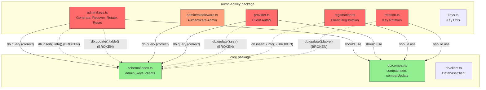
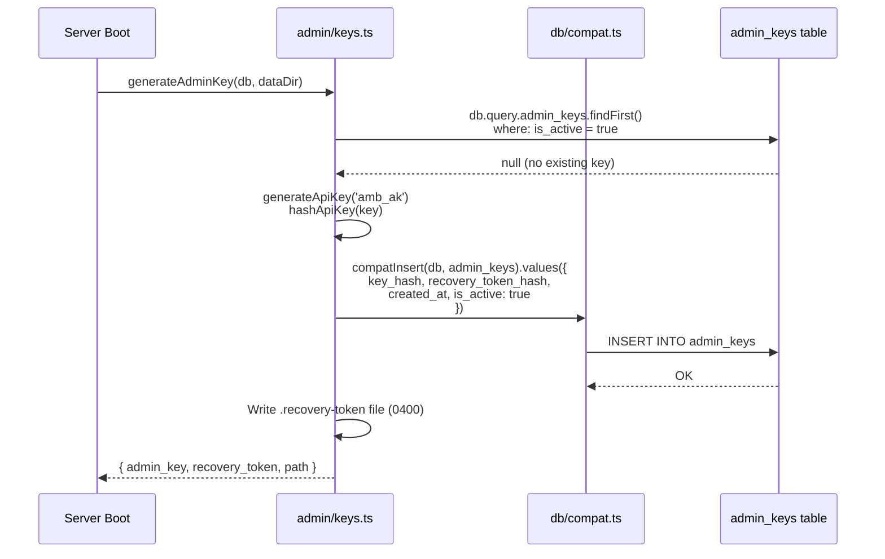

# ADR-007: Authn-APIKey Package – Schema, API & ADR Reconciliation

**Status:** Accepted  
**Date:** February 17, 2026  
**Accepted:** February 17, 2026  
**Author:** Architect  
**Approved By:** Technical Manager (with Architect review conditions)  
**Deciders:** Technical Manager, Database Engineer, Lead Developer  
**References:** ADR-006, `packages/core/src/schema/index.ts`, `packages/authn-apikey/src/`  

---

## Context

The `authn-apikey` package has ~30 TypeScript type errors stemming from **three independent root causes** that together make the package non-compilable. This ADR documents the mismatches, proposes reconciliation options, and recommends a path forward.

### Root Cause 1: Schema Field Name Mismatch

The `admin_keys` schema (designed by Database Engineer) and the `admin/keys.ts` implementation (written by Lead Developer) use **different field names and types** for the same concepts:

| Concept | Schema (`core/schema`) | Implementation (`admin/keys.ts`) | ADR-006 Intent |
|---|---|---|---|
| Primary key | `id` (integer, auto-increment) | `key_id` (string, UUID) | UUID for audit attribution |
| Active state | `is_active` (boolean) | `status` ('active' \| 'revoked') | Enum for richer lifecycle |
| Rotation time | `rotated_at` (text, nullable) | `last_rotated_at` (text) | Last rotation timestamp |

The schema uses a simplified model (boolean active, auto-increment PK), while the implementation follows ADR-006 more literally (UUID PK, enum status).

### Root Cause 2: Wrong Drizzle ORM API Surface

The implementation uses a **non-existent Drizzle API** (jQuery-style chaining) that will fail at runtime:

```typescript
// WRONG — this API does not exist in Drizzle ORM
await db.insert().into('admin_keys').values({...}).run();
await db.update().table('admin_keys').set({...}).where(...).run();

// CORRECT — Drizzle API (with compat wrappers for union types)
await compatInsert(db, admin_keys).values({...});
await compatUpdate(db, admin_keys).set({...}).where(...);
```

**Affected sites (7 locations):**

| File | Line | Wrong API | Correct Pattern |
|---|---|---|---|
| `admin/keys.ts` | 84 | `db.insert().into('admin_keys')` | `compatInsert(db, admin_keys)` |
| `admin/keys.ts` | 190 | `db.update().table('admin_keys')` | `compatUpdate(db, admin_keys)` |
| `admin/keys.ts` | 265 | `db.update().table('admin_keys')` | `compatUpdate(db, admin_keys)` |
| `admin/keys.ts` | 338 | `db.update().table('admin_keys')` | `compatUpdate(db, admin_keys)` |
| `registration.ts` | 149 | `db.insert().into('clients')` | `compatInsert(db, clients)` |
| `rotation.ts` | 77 | `db.update().table('clients')` | `compatUpdate(db, clients)` |
| `provider.ts` | 157 | `db.update().set({...}).where(...)` | `compatUpdate(db, clients).set({...}).where(...)` |

The `db.query.*` calls (relational queries) are **correct** and work with the schema-aware `DatabaseClient` type. Only the mutation operations use the wrong API.

### Root Cause 3: Minor Type Issues

- Missing `@types/uuid` (now installed)
- Unused imports (`redactIp`, `AmbassadorError`, `config` parameter)
- `profileId` type narrowing (`string | undefined` → `string`)

---

## Options

### Option A: Update Schema to Match ADR-006

Add `key_id` (UUID text PK), `status` (text enum), `last_rotated_at` to schema. Remove `id` (auto-increment), `is_active` (boolean).

| Criterion | Assessment |
|---|---|
| ADR Compliance | ✅ Exact match to ADR-006 design |
| Migration | ⚠️ Requires schema migration for any existing data |
| Simplicity | ❌ Adds UUID generation requirement for admin keys |
| Phase 1 Fit | ⚠️ Over-designed for single-admin (Phase 1 is single key) |
| Drizzle API | 🔧 Still requires fixing all 7 mutation calls |

### Option B: Update Implementation to Match Schema

Change code from `key_id` → `id`, `status` → `is_active`, `last_rotated_at` → `rotated_at`. Fix all Drizzle API calls. Adapt query patterns (`keys.status === 'active'` → `keys.is_active === true`).

| Criterion | Assessment |
|---|---|
| ADR Compliance | ⚠️ Diverges from ADR-006 field names (acceptable for Phase 1) |
| Migration | ✅ No schema changes needed |
| Simplicity | ✅ Uses existing schema as-is |
| Phase 1 Fit | ✅ Boolean active is sufficient for single-admin |
| Drizzle API | 🔧 Still requires fixing all 7 mutation calls |

### Option C: Reconcile Both (Recommended)

Update schema to add `key_id` (UUID) for audit attribution per ADR-006, but keep `is_active` (boolean) for Phase 1 simplicity. Rename `rotated_at` → `last_rotated_at` for clarity. Fix all implementation Drizzle API calls.

| Criterion | Assessment |
|---|---|
| ADR Compliance | ✅ UUID for audit attribution, lifecycle model deferred to Phase 2 |
| Migration | ⚠️ Modest schema change (add column, rename column) |
| Simplicity | ✅ Boolean active for Phase 1, enum status reserved for Phase 2 |
| Phase 1 Fit | ✅ Right-sized |
| Drizzle API | 🔧 Still requires fixing all 7 mutation calls |

---

## Analysis: Drizzle API Fix Pattern

Regardless of which schema option is chosen, **all 7 mutation sites must be rewritten** to use correct Drizzle syntax. The pattern is consistent:

```typescript
// Import compat wrappers (already used in core/repositories/clients.ts)
import { compatInsert, compatUpdate } from '@mcpambassador/core';
// Import schema tables
import { admin_keys, clients } from '@mcpambassador/core';
import { eq } from 'drizzle-orm';

// INSERT: was db.insert().into('admin_keys').values({}).run()
await compatInsert(db, admin_keys).values({
  key_hash: adminKeyHash,
  recovery_token_hash: recoveryTokenHash,
  created_at: now,
  // ... fields matching schema
});

// UPDATE: was db.update().table('admin_keys').set({}).where(fn).run()
await compatUpdate(db, admin_keys)
  .set({ key_hash: newHash, rotated_at: now })
  .where(eq(admin_keys.is_active, true));

// SELECT (already correct): db.query.admin_keys.findFirst({...})
```

The `db.query.admin_keys.findFirst()` pattern works correctly because the `DatabaseClient` type now includes the schema generic parameter (fixed in previous commit).

---

## Impact Summary

### Files Requiring Changes

| File | Schema Changes | API Fixes | Field Renames | Unused Imports |
|---|---|---|---|---|
| `core/schema/index.ts` | Option-dependent | — | — | — |
| `admin/keys.ts` | — | 4 mutations | 15 field refs | 1 (`redactIp`) |
| `admin/middleware.ts` | — | 0 mutations | 1 field ref | 1 (`AmbassadorError`) |
| `provider.ts` | — | 1 mutation | 0 | 1 (`config` param) |
| `registration.ts` | — | 1 mutation | 0 | 0 |
| `rotation.ts` | — | 1 mutation | 0 | 0 |

### Error Count by Root Cause

| Root Cause | Error Count | Fix Complexity |
|---|---|---|
| Schema field mismatch | ~16 | Medium (field renames + query updates) |
| Wrong Drizzle API | ~10 | Low (mechanical API rewrite) |
| Minor type issues | ~4 | Low (unused imports, type narrowing) |
| **Total** | **~30** | **Medium overall** |

---

## Recommendation

**Option B (Update Implementation to Match Schema)** is recommended for Phase 1:

1. **Zero schema migration risk** — No existing database instances need updating
2. **Schema was designed by Database Engineer** — The simplified model (boolean, auto-increment) is intentional for Phase 1
3. **ADR-006 UUID attribution can be deferred** — For Community single-admin, the auto-increment `id` is sufficient. ADR-006 cites UUID for audit attribution, but single-admin Community doesn't need per-key identity
4. **Drizzle API fixes are mechanical** — Same pattern as core/repositories, well-established
5. **Smallest diff** — Only implementation changes, no schema/migration work

Phase 2 schema migration can add `key_id` (UUID) and `status` (enum) when multi-admin support is implemented, per ADR-006 Phase 2 timeline.

---

## Consequences

### If Option B is adopted

**Positive:**
- Zero schema changes, zero migration risk
- Consistent with core package Drizzle patterns (compat wrappers)
- All 30 type errors resolved
- Package becomes compilable and testable

**Negative:**
- `AdminKeyRecord` interface in code diverges from ADR-006 (acceptable for Phase 1)
- Must update ADR-006 or add a note that Phase 1 uses simplified schema
- Auto-increment `id` provides less audit attribution than UUID `key_id`

**Trade-offs explicitly accepted:**
- Boolean `is_active` instead of enum `status` — sufficient for Phase 1 single-admin. Note: `factoryResetAdminKey` conflates "revoked" and "inactive" under boolean; acceptable for single-key Phase 1.
- Integer `id` instead of UUID `key_id` — sufficient when only one active key exists. Auto-increment PK is never exposed via API.
- `rotated_at` instead of `last_rotated_at` — semantic but not functional difference

---

## Implementation Conditions

The following conditions were required by the Architect review (February 17, 2026) and must be met during implementation:

### Condition 1: Integration Tests for All 7 Mutation Sites

Since `compatInsert`/`compatUpdate` return `any`, TypeScript provides no compile-time safety on field names. M4.8 tests must exercise all 7 mutation paths:

| # | Mutation | Test Coverage Required |
|---|---|---|
| 1 | Insert admin_key (generate) | Verify key_hash, recovery_token_hash, is_active=true stored |
| 2 | Update admin_key (recover) | Verify key_hash updated, is_active unchanged |
| 3 | Update admin_key (rotate) | Verify key_hash + recovery_token_hash updated |
| 4 | Update admin_key (factory-reset) | Verify is_active=false on old key, new key inserted |
| 5 | Insert client (register) | Verify all client fields stored correctly |
| 6 | Update client (rotate key) | Verify api_key_hash updated, last_seen_at updated |
| 7 | Update client (last_seen_at) | Verify background update succeeds |

### Condition 2: WHERE Clauses Must Target by Primary Key

Record-specific mutations (recover, rotate) must use `WHERE id = ?` (the auto-increment PK), not solely `WHERE is_active = true`. This prevents race conditions in future multi-key scenarios.

```typescript
// CORRECT: target by PK for record-specific mutations
await compatUpdate(db, admin_keys)
  .set({ key_hash: newHash, rotated_at: now })
  .where(eq(admin_keys.id, adminKeyRecord.id));

// AVOID: ambiguous for future multi-key scenarios
await compatUpdate(db, admin_keys)
  .set({ key_hash: newHash })
  .where(eq(admin_keys.is_active, true));
```

Exception: `factoryResetAdminKey` may use `WHERE is_active = true` to deactivate all active keys (bulk operation by design).

### Condition 3: ADR-006 Cross-Referenced

ADR-006 has been annotated with a Phase 1 Implementation Notes section referencing this ADR. See ADR-006 § "Phase 1 Implementation Notes."

### Condition 4: Phase 2 Migration Path Documented

See "Phase 2 Migration Path" section below.

---

## Phase 2 Migration Path

When multi-admin support is implemented (Phase 2, per ADR-006 timeline), the `admin_keys` schema must evolve to full ADR-006 compliance:

### Migration Steps

1. **Create new table with target schema:**
   ```sql
   CREATE TABLE admin_keys_v2 (
     key_id TEXT PRIMARY KEY NOT NULL,  -- UUIDv4 (per ADR-006)
     key_hash TEXT NOT NULL UNIQUE,
     recovery_token_hash TEXT NOT NULL,
     created_at TEXT NOT NULL,
     last_rotated_at TEXT,              -- Renamed from rotated_at
     status TEXT NOT NULL DEFAULT 'active',  -- 'active' | 'revoked' | 'expired'
     admin_identity TEXT               -- Phase 2: email or user ID
   );
   ```

2. **Migrate existing data:**
   ```sql
   INSERT INTO admin_keys_v2 (key_id, key_hash, recovery_token_hash, created_at, last_rotated_at, status)
   SELECT
     lower(hex(randomblob(4)) || '-' || hex(randomblob(2)) || '-4' || 
           substr(hex(randomblob(2)),2) || '-' || 
           substr('89ab', abs(random()) % 4 + 1, 1) || 
           substr(hex(randomblob(2)),2) || '-' || 
           hex(randomblob(6))) as key_id,
     key_hash,
     recovery_token_hash,
     created_at,
     rotated_at as last_rotated_at,
     CASE WHEN is_active = 1 THEN 'active' ELSE 'revoked' END as status
   FROM admin_keys;
   ```

3. **Swap tables:**
   ```sql
   ALTER TABLE admin_keys RENAME TO admin_keys_backup;
   ALTER TABLE admin_keys_v2 RENAME TO admin_keys;
   ```

4. **Recreate indexes:**
   ```sql
   CREATE INDEX idx_admin_keys_status ON admin_keys(status);
   ```

5. **Update application code:** Change field references from `id`/`is_active`/`rotated_at` to `key_id`/`status`/`last_rotated_at`.

6. **Verify and drop backup:** After validation, `DROP TABLE admin_keys_backup;`

### SQLite Constraints

- SQLite does not support `DROP COLUMN` or `RENAME COLUMN` (prior to 3.35.0)
- Table recreation (steps 1-3) is the standard SQLite migration pattern
- Drizzle ORM's migration toolkit can generate these steps automatically
- The migration must be idempotent (check if `admin_keys_v2` exists before creating)

### Data Preservation

- All existing admin key hashes and recovery tokens are preserved
- `is_active` boolean maps cleanly to `status` enum (true→'active', false→'revoked')
- Auto-generated UUIDs for `key_id` maintain referential integrity
- Rollback: rename backup table back if migration fails

---

## Component Diagram



**Legend:** Red = has broken Drizzle API calls. Orange = has schema field mismatch only. Green = correct, no changes needed.

---

## Data Flow: Admin Key Generation (After Fix)



---

## Related

- ADR-006: Admin Authentication Model (admin key design)
- `packages/core/src/db/compat.ts`: Compatibility wrappers for Drizzle union types
- `packages/core/src/db/repositories/clients.ts`: Reference implementation using correct Drizzle API
- `docs/drizzle-type-errors-report.md`: Drizzle union type resolution report
